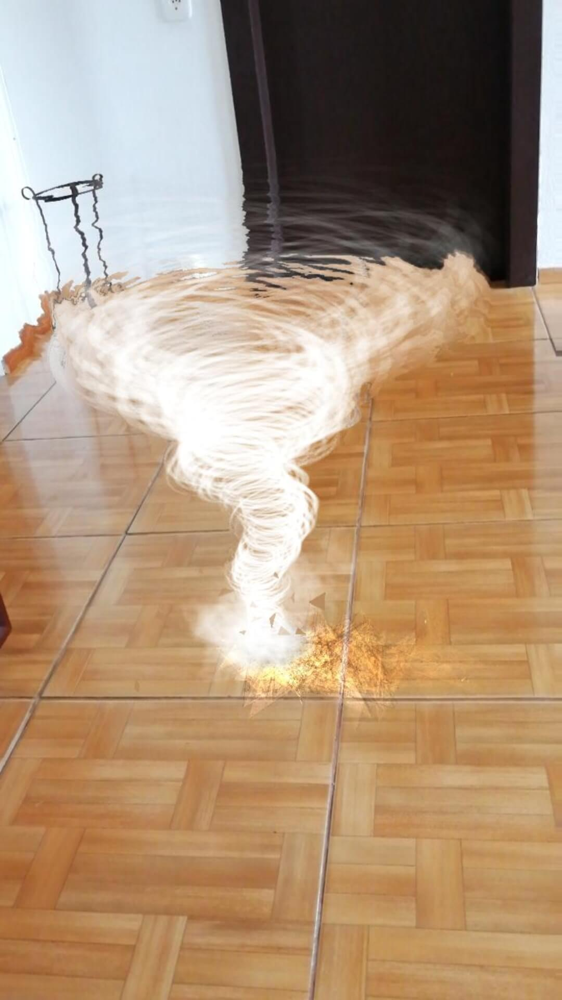
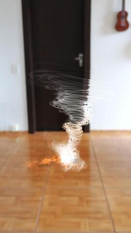

# Tornado-Spark-Ar-Project
Spark AR project developed on "2020 Spark AR Creator Collab" acceleration program and improved during the Eddy Adams course ([Spark AR Masterclass](https://www.sparkarmasterclass.com/))

Developed Version: **Spark AR Studio v106**

Effect Link: [https://www.instagram.com/ar/1086391031820313/](https://www.instagram.com/ar/1086391031820313/)
## Features

- [x] World Object
- [x] Particle Emitter
- [x] Texture Distortion
- [x] Delay Frame

## Screenshots

## Author
José Luís Haas

Follow me on Instagram [@zeco.lab](https://instagram.com/zeco.lab)

## License

